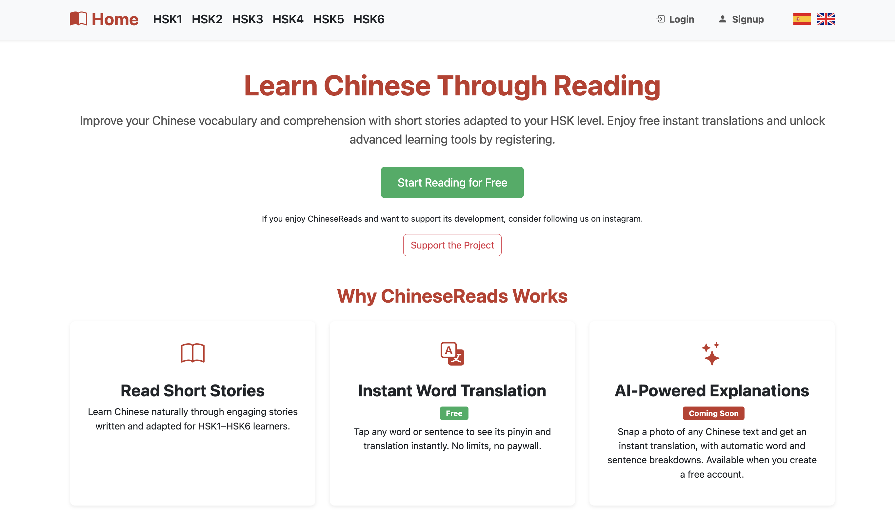
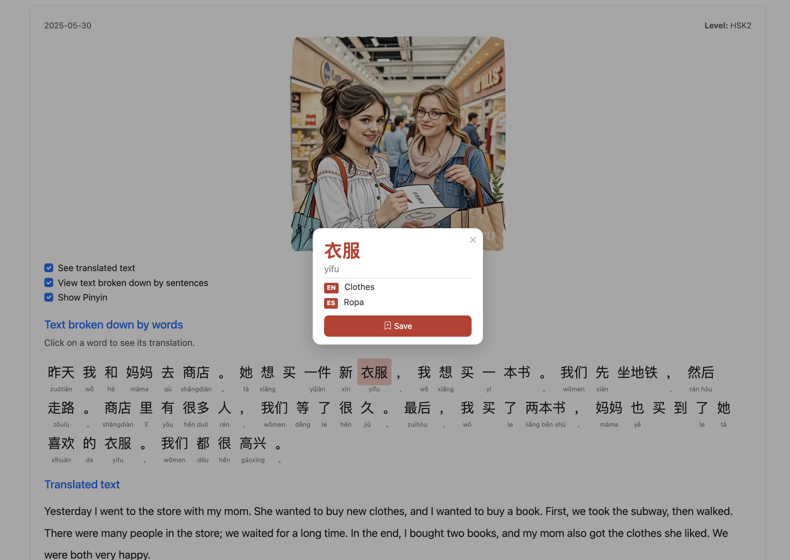
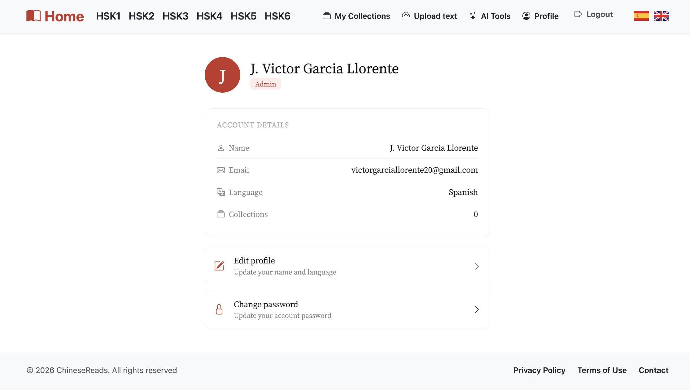
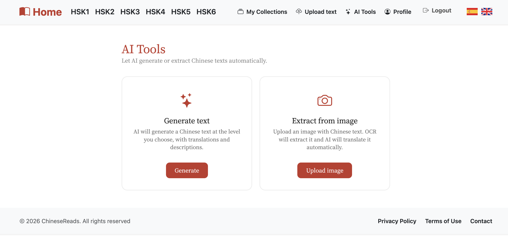

# ChineseReads

ChineseReads is a web application designed to facilitate the learning of Mandarin Chinese through graded texts, spaced-repetition flashcards (SM-2), vocabulary collections, exams, an AI word tutor, text-to-speech audio pronunciation, reading streaks and personal statistics, a free HSK level test, a learn-to-read tutorial, user-generated private texts (paste or OCR photo), a blog and an influencer Hall of Fame. A free tier keeps the core reading tools open to everyone, with an optional **PREMIUM** subscription (via Stripe) that raises usage limits. The interface is available in English and Spanish, fully SEO-optimized (live SSR for dynamic pages). Its purpose is to promote accessible language education for everyone.

---
> ⚠️ The application is live at [chinesereads.com](https://chinesereads.com). All planned functionality is implemented; the remaining technical objective is the CI/CD pipeline (see [Objectives](docs/objectives.md)).

---

## App Screenshots

### Home

### Texts

### Text (word breakdown)

### Collections & Flashcards

### Profile

### AI Tools

---

## Documentation Index

- [Objectives](docs/objectives.md)
- [Methodology](docs/methodology.md)
- [Functional Specifications](docs/functional-specs.md)
- [Analysis](docs/analysis.md)
- [Development Guide](docs/dev-guide.md)
- [Quality Control](docs/quality-control.md)
- [Follow-up](docs/follow-up.md)

---

## Author

**Student:** José Víctor García Llorente  
**Supervisor:** Michel Maes Bermejo

---

## License

This project is under the Apache License 2.0. See the [LICENSE](./LICENSE) file for more details.