# 2025-ChineseTexts

ChineseReads is a web application designed to facilitate the learning of Mandarin Chinese through short texts, spaced repetition and AI‑based utilities. Its purpose is to promote education that is accessible to everyone. The system will allow users to read texts by level, create vocabulary collections, take personalized exams, analyze images containing Chinese text, and much more.

## App

The following section provides an overview of the app, screens and user interface.

### Home screen:
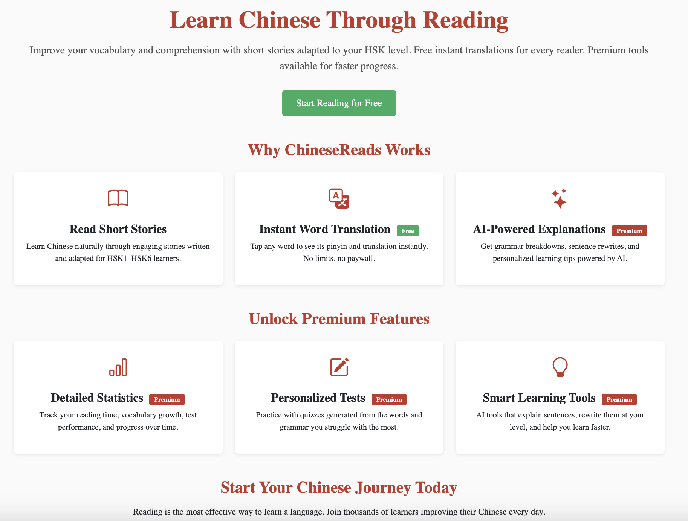

### Texts screen:

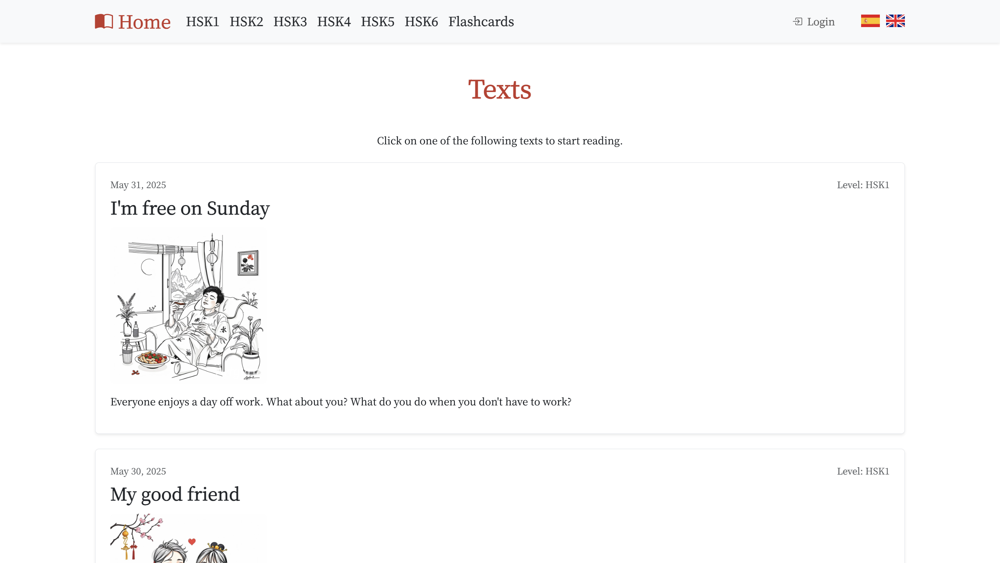

### Text screen:

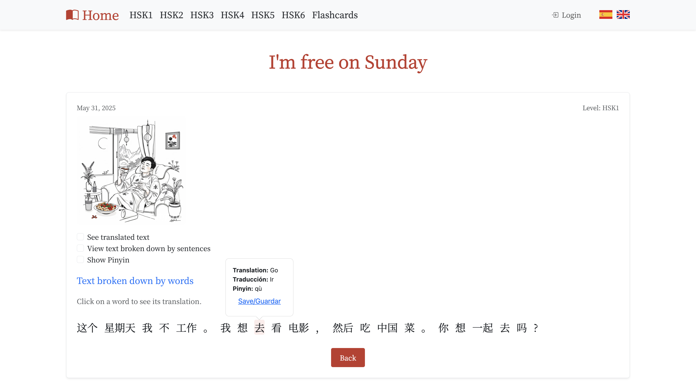

### Profile screen:

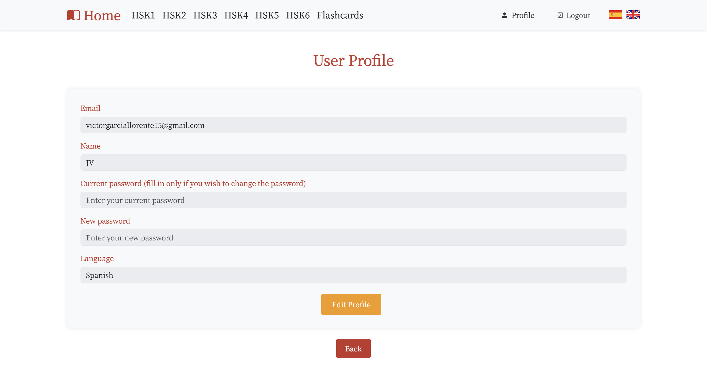

### Collections screen:

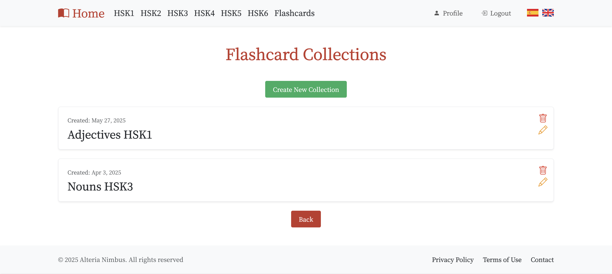

### Flashcards screen:

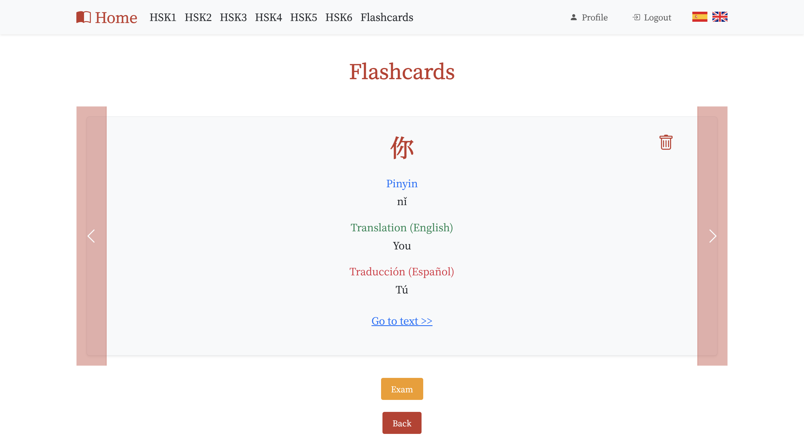

### Signup screen:

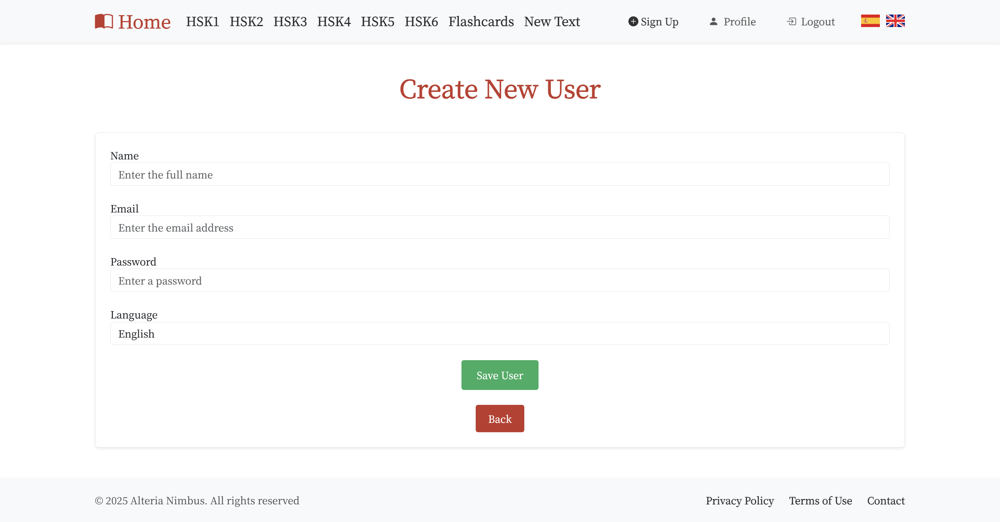

### Add text screen:

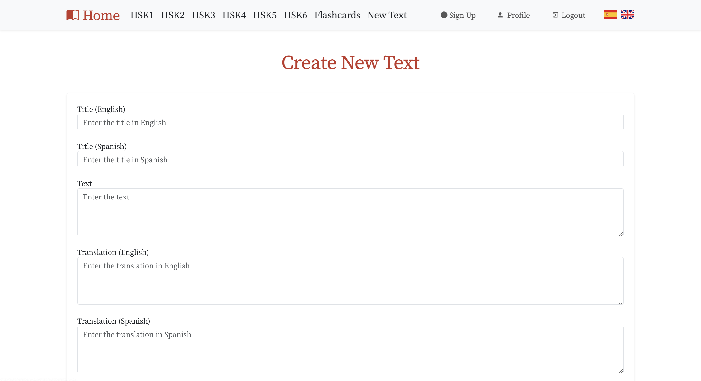

### Exam screen:
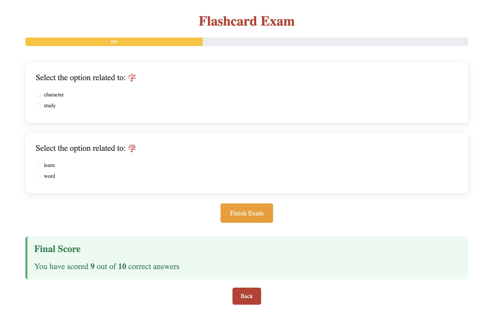

### Admin panel screen:
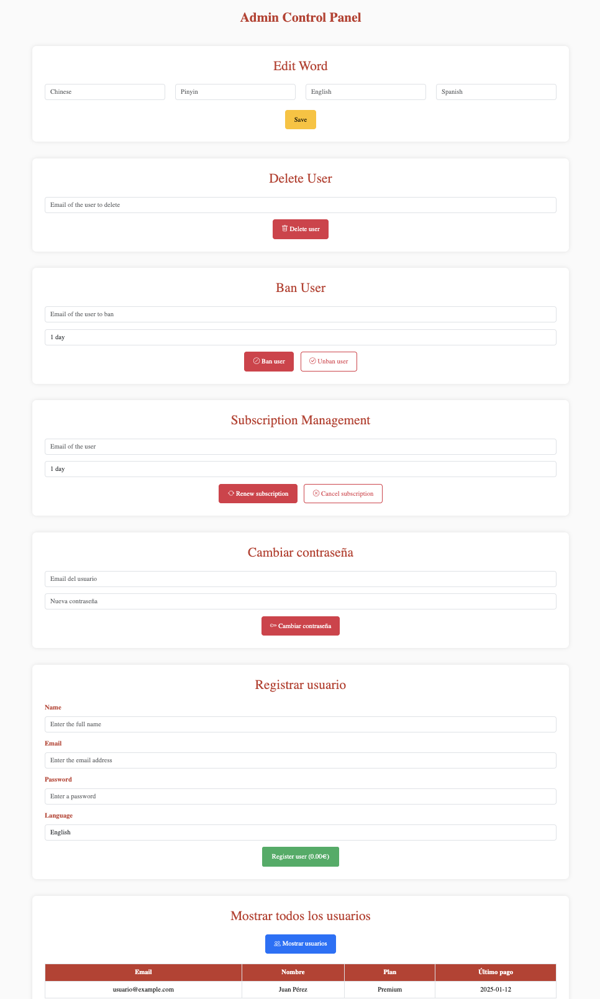

### AI-Tools screen:
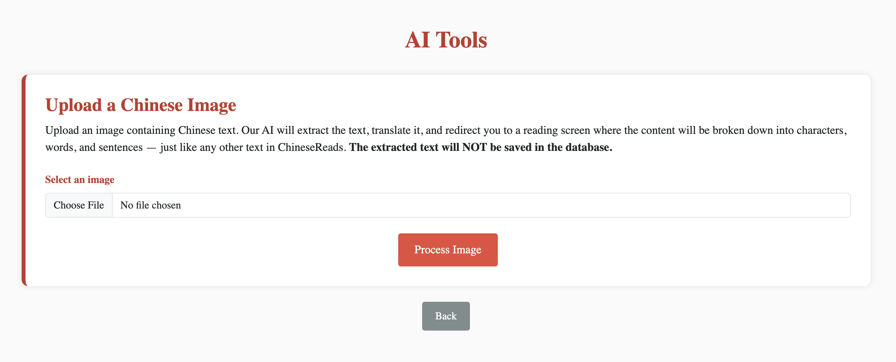

### Statistics screen:
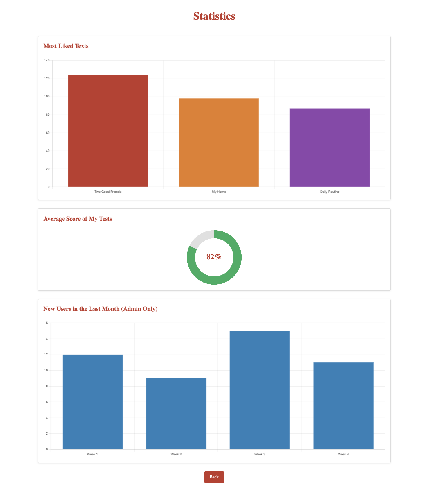

### Success screen:

### Error screen:

## Screen Navigation Diagram

The following diagram outlines the navigation flow between screens.

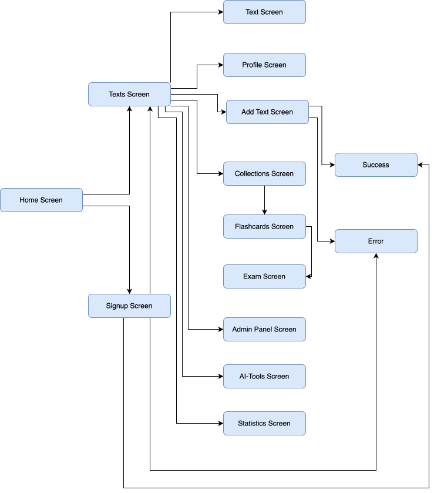

## Functional Objectives

This document defines only the initial functional and technical objectives of the application. The implementation has not started yet and both the functional and technical objectives may change.

### Functional Objectives

The main functional goal of ChineseReads is to provide a structured and accessible platform for learning Mandarin Chinese through graded texts, vocabulary tools, personalized study features, and AI‑assisted utilities. The application aims to support users with different roles and offer a wide range of learning interactions.

#### Planned Functionalities

- Display texts organized by difficulty level.
- Allow users to register accounts with a payment gateway.
- Enable premium and admin users to like texts.
- Allow premium and admin users to edit their profile information.
- Allow premium and admin users to create vocabulary collections and add words to them.
- Generate random exams based on selected collections.
- Break down texts into words and sentences and showing their translation. Display detailed text breakdowns (characters, pinyin, etc.).
- Provide personalized statistics for premium and admin users.
- Allow administrators to create new texts.
- Allow administrators to generate AI‑based texts.
- Allow premium and admin users to analyze images and extract Chinese text automatically.
- Allow administrators to modify another user's password, ban/delete users or perform other actions on someone else's account.

---

## Technical Objectives

The technical objective of the project is to build a distributed, modular, and scalable system composed of multiple independent services. The application will rely on containerization, cloud deployment, and modern web technologies to ensure maintainability and future expansion.

### Planned Technical Aspects

- Use an scalable and distributed architecture composed of three or more independent services.
- Package each service using containerization technologies.
- Deploy the system in the cloud using Kubernetes.
- Enable communication between services through REST APIs.
- Use an appropriate database system for all the information used in the app.
- Integrate AI services to improve efficiency.
- Implement image processing capabilities for extracting Chinese text.
- Apply design patterns if needed and develop a modern web frontend using a contemporary framework.
- Manage configuration and sensitive data securely.
- Prepare the system for future integrations and feature expansions.

## Permissions

| Basic functionality                                 | Unregistered user | Premium user | Admin |
|----------------------------------------------------|:-----------------:|:------------:|:-----:|
| **Show texts by level**                            | ✅ | ✅ | ✅ |
| **Register user (no payment gateway)**             | ✅ | ✅ | ✅ |
| **Like a text**                                    | ❌ | ✅ | ✅ |
| **Edit user**                                      | ❌ | ✅ | ✅ |
| **Modify another user's password**                 | ❌ | ❌ | ✅ |
| **Ban user / delete user**                         | ❌ | ❌ | ✅ |
| **Create collection**                              | ❌ | ✅ | ✅ |
| **Add word to collection**                         | ❌ | ✅ | ✅ |

| Intermediate functionality                          | Unregistered user | Premium user | Admin |
|----------------------------------------------------|:-----------------:|:------------:|:-----:|
| **Create random exam (collection/s)**              | ❌ | ✅ | ✅ |
| **View text breakdown**                            | ✅ | ✅ | ✅ |
| **Create new text**                                | ❌ | ❌ | ✅ |
| **Calculate and display statistics**               | ❌ | ✅ | ✅ |

| Advanced functionality                              | Unregistered user | Premium user | Admin |
|----------------------------------------------------|:-----------------:|:------------:|:-----:|
| **Register user (with payment gateway)**           | ✅ | ✅ | ✅ |
| **Create AI‑generated text**                       | ❌ | ❌ | ✅ |
| **Analyze image and automatically break down text** | ❌ | ✅ | ✅ |

## Data model

### Entity-Relationship Diagram:

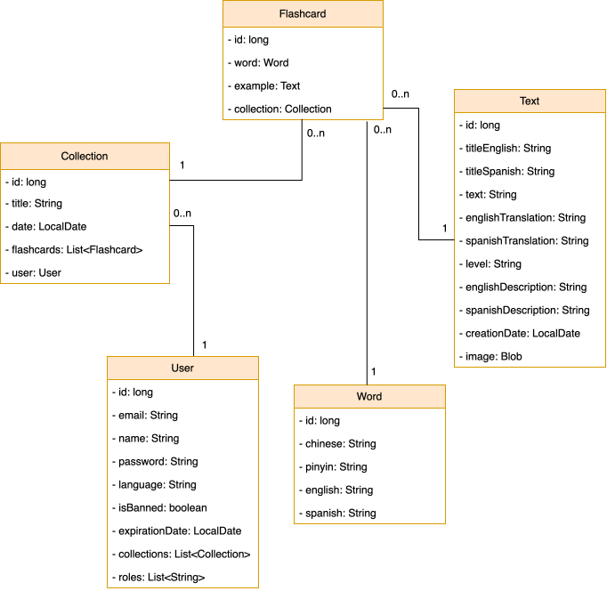

## Architecture

### Cloud architecture:

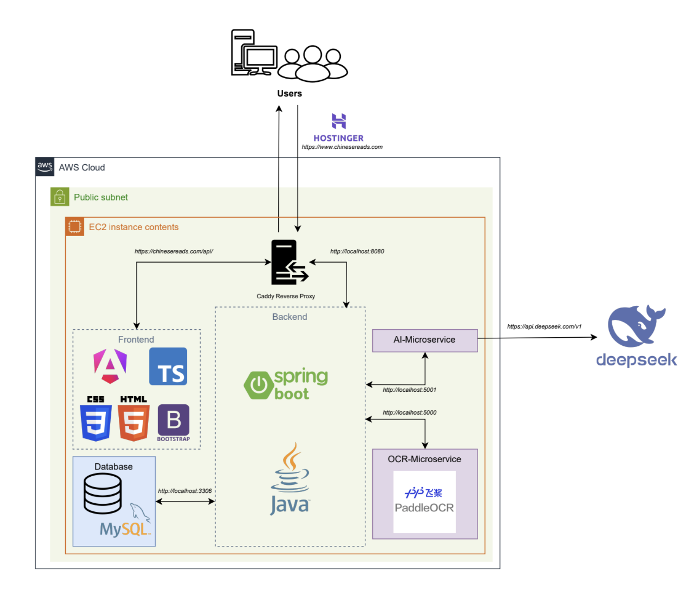

## Author

**Student:** José Víctor García Llorente.  
**Supervisor:** Michel Maes Bermejo.

---

## License

This project is under the Apache License 2.0. See the [LICENSE](./LICENSE) file for more details.
