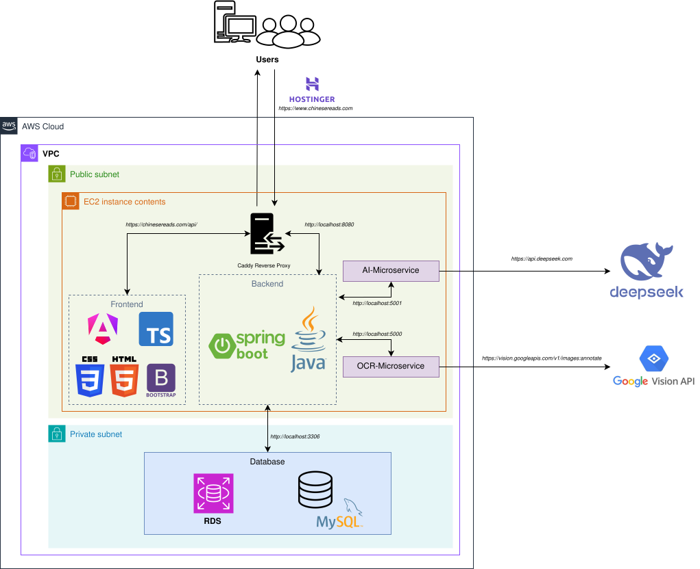

# Analysis

## Architecture Overview

ChineseReads uses a **distributed MVC architecture** composed of five independent services:

1. **Spring Boot Backend** — REST API, business logic, JWT authentication
2. **Angular Frontend** — SPA with SSR, served as static files by Caddy
3. **DeepSeek AI Microservice** — Python/Flask, text generation and translation
4. **Google OCR Microservice** — Python/Flask, Chinese text extraction from images
5. **Google TTS Microservice** — Python/Flask, text-to-speech audio synthesis of Chinese text

### Cloud Architecture Diagram

## API Design

The backend exposes a RESTful API organized around the following resources:

| Resource | Base path | Description |
|---|---|---|
| Texts | `/api/texts` | CRUD for Chinese texts, word/sentence breakdown |
| Words | `/api/words` | Dictionary lookup and word creation |
| Users | `/api/users` | Registration, profile management |
| Auth | `/api/auth` | Login, logout, token refresh |
| Collections | `/api/collections` | Collection management, flashcards |
| AI | `/api/ai` | Text generation and OCR processing |
| Audio (TTS) | `/api/tts` | Text-to-speech synthesis of Chinese text (public) |

## Security

- Authentication via **JWT tokens stored in HttpOnly cookies** (not accessible from JavaScript).
- Role-based access control: `ROLE_USER` and `ROLE_ADMIN`.
- Passwords hashed with **BCrypt**.
- CSRF disabled (stateless JWT architecture).
- HTTPS enforced via Caddy with automatic Let's Encrypt certificates.