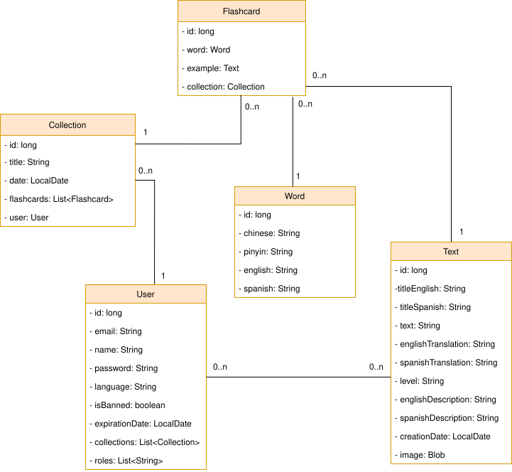

# Functional Specifications

## User Roles

| Role | Description |
|---|---|
| **Unregistered user** | Can browse and read texts, see word/sentence breakdowns, and listen to text/word/sentence audio |
| **Registered user** | Can create collections, save words, study and take exams, edit profile, and generate private texts (within the free monthly limit) |
| **Admin** | All registered user capabilities plus text management, dictionary word management, AI tools, and user management (block/delete/edit, grant premium) |

> **PREMIUM is a subscription state, not a separate role.** Any registered user can subscribe (via Stripe) to become premium; internally this is a time-boxed expiry (`User.premiumUntil`), set either by a successful Stripe payment or by an admin grant. While active, it raises the user's monthly usage limits. It is deliberately **not** a static role, so it can expire on its own.

## Permissions Table

| Functionality | Unregistered | Registered | Admin |
|---|:---:|:---:|:---:|
| Browse texts by level | ✅ | ✅ | ✅ |
| Read text with word/sentence breakdown | ✅ | ✅ | ✅ |
| Listen to text / word / sentence (audio) | ✅ | ✅ | ✅ |
| Switch UI language (English / Spanish) | ✅ | ✅ | ✅ |
| Register | ✅ | ✅ | ✅ |
| Login / Logout | ❌ | ✅ | ✅ |
| Edit profile | ❌ | ✅ | ✅ |
| Create collections | ❌ | ✅ | ✅ |
| Save words to collections | ❌ | ✅ | ✅ |
| Listen to flashcard word (audio) | ❌ | ✅ | ✅ |
| Rename / delete collections | ❌ | ✅ | ✅ |
| Study mode | ❌ | ✅ | ✅ |
| Exam mode | ❌ | ✅ | ✅ |
| Generate a private text (OCR photo / paste) | ❌ | ✅ | ✅ |
| Subscribe to PREMIUM (Stripe) | ❌ | ✅ | ✅ |
| Manage / cancel subscription (Stripe portal) | ❌ | ✅ | ✅ |
| Higher monthly generation limit | ❌ | Premium only | ✅ (exempt) |
| Manage users: block / unblock, delete, edit | ❌ | ❌ | ✅ |
| Grant / revoke PREMIUM to a user | ❌ | ❌ | ✅ |
| Upload new text | ❌ | ❌ | ✅ |
| Validate text (missing words) | ❌ | ❌ | ✅ |
| Delete text | ❌ | ❌ | ✅ |
| Generate AI text | ❌ | ❌ | ✅ |
| Extract text from image (OCR) | ❌ | ❌ | ✅ |
| Manage dictionary: add word | ❌ | ❌ | ✅ |
| Manage dictionary: edit word | ❌ | ❌ | ✅ |
| Manage dictionary: delete word | ❌ | ❌ | ✅ |

## Data Model

### Entities

- **User** — id, email, name, language, password (bcrypt), roles, blocked, registrationDate, lastAccess, termsAcceptedAt (GDPR consent proof), monthlyTextCount + usagePeriodStart (monthly usage quota), premiumUntil (premium expiry — single source of truth), stripeCustomerId, stripeSubscriptionId
- **Text** — id, titleEnglish, titleSpanish, text (Chinese), englishTranslation, spanishTranslation, englishDescription, spanishDescription, level (HSK1–HSK6), creationDate, image (BLOB)
- **UserText** — a registered user's own private text generated from a photo (OCR) or pasted text: id, owner (FK), Chinese text, per-sentence translations and per-word definitions
- **Word** — id, chinese, pinyin, english, spanish
- **Collection** — id, title, date, user (FK)
- **Flashcard** — id, collection (FK), word (FK), example/text (FK)
- **AppUsage** — global daily generation counter (day, count) backing the per-day cost fuse

### Entity-Relationship Diagram

