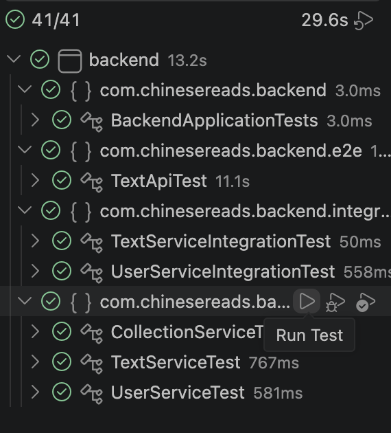
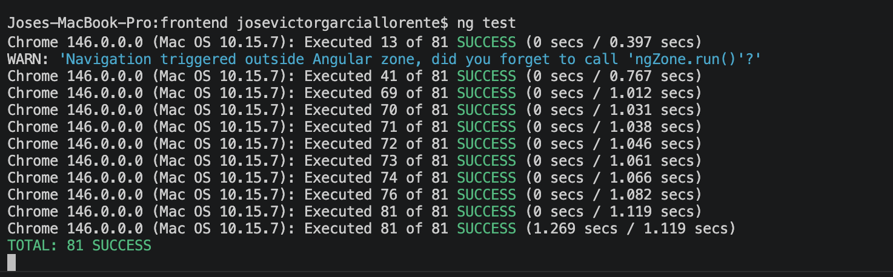

# Quality Control

## Overview

ChineseReads applies automated testing at multiple levels across both the backend (Java/Spring Boot) and the frontend (Angular). The goal is to verify that the core business logic, API endpoints, and UI components behave correctly.

---

## Backend Tests

### Unit Tests (Mockito)

Located in `backend/src/test/java/com/chinesereads/backend/`.

Tests that verify the business logic of individual service classes in isolation, using Mockito to mock dependencies.

| Test class | Service under test | Functionalities covered |
|---|---|---|
| `UserServiceTest` | `UserService` | User creation, duplicate email validation, password encoding, role assignment |
| `TextServiceTest` | `TextService` | Text pagination, level filtering, text upload, duplicate title detection |
| `CollectionServiceTest` | `CollectionService` | Collection creation, ownership validation, flashcard management |

### Integration Tests (H2)

Tests that verify the interaction between the service layer and the database using an in-memory H2 database. Spring Boot test profile (`application-test.properties`) configures H2 with `NON_KEYWORDS=COLLECTION,USER` to avoid SQL conflicts.

| Test class | Functionalities covered |
|---|---|
| `UserServiceIntegrationTest` | End-to-end user registration and retrieval through the real JPA layer |
| `TextServiceIntegrationTest` | Text creation, retrieval, and deletion with real database operations |

### E2E API Tests (MockMvc)

Tests that verify the full HTTP request/response cycle through the Spring MVC layer without starting a real server. Uses `@SpringBootTest`.

| Test class | Endpoints covered |
|---|---|
| `TextApiTest` | `GET /api/texts`, `POST /api/texts`, `GET /api/texts/{id}`, `POST /api/texts/validate`, `GET /api/users/me` |

These tests also verify authorization: that unauthenticated requests return 401, that regular users cannot access admin endpoints (403), and that authenticated admin users can perform all operations.

### Test execution screenshot

### Statistics

| Category | Count |
|---|---|
| Unit tests | ~14 |
| Integration tests | ~9 |
| E2E tests | ~10 |
| **Total backend** | **~33** |

---

## Frontend Tests

### Component Tests (Jasmine/Karma)

Located in `frontend/src/app/components/**/*.spec.ts`.

Each test file verifies the logic of an Angular component in isolation. HTTP calls are replaced with Jasmine spies that return controlled observables, so no backend is needed to run the tests.

| Spec file | Component | Functionalities tested |
|---|---|---|
| `texts.component.spec.ts` | `TextsComponent` | Text loading, pagination, level filtering, like toggle, admin delete modal |
| `text.component.spec.ts` | `TextComponent` | Chinese text word splitting, sentence grouping, word popover open/close, translation loading, save word panel |
| `collections.component.spec.ts` | `CollectionsComponent` | Collection loading, selection, study/exam mode start, delete modal, rename modal |
| `profile.component.spec.ts` | `ProfileComponent` | Profile data loading, edit mode, password change flow |
| `signup.component.spec.ts` | `SignupComponent` | Form validation (required fields, email format, password min length), registration success and error flows, redirect if already logged in |
| `header.component.spec.ts` | `HeaderComponent` | Login validation (empty fields, wrong credentials), successful login, logout and redirect |
| `upload-text.component.spec.ts` | `UploadTextComponent` | Form completeness check, sentence count validation, missing word detection, word save flow, text upload success and 409 conflict |
| `ai-tools.component.spec.ts` | `AiToolsComponent` | Mode switching, upload preconditions, missing word validation, admin redirect |

### Test execution screenshot

### Statistics

| Metric | Value |
|---|---|
| Total specs | 81 |
| Failures | 0 |
| Components covered | 8 |

---

## Code Metrics

*(pending — add output from a static analysis tool or manual line count)*

| Layer | Files | Approx. lines of code |
|---|---|---|
| Backend (Java) | ~35 | ~2,500 |
| Frontend (TypeScript/HTML/SCSS) | ~50 | ~4,000 |
| Python microservices | ~2 | ~250 |
| **Total** | **~87** | **~6,750** |